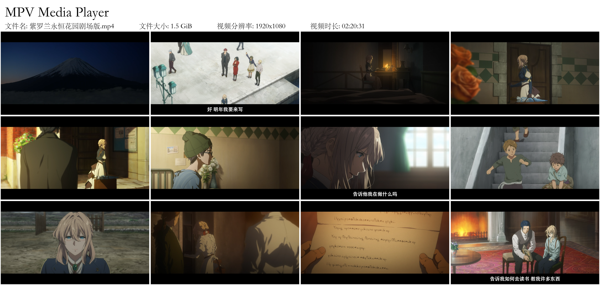

# mpv_screenshot-mosaic

适用于mpv视频播放器的JS扩展脚本，用于创建视频摘要


<br/><br/>

## 安装

1. 安装 [`ImageMagick`](https://imagemagick.org/script/download.php) 软件，并确保该软件的 `montage` 指令为可用状态；

2. 使用 git clone 或 下载zip ，打开[dist](dist)文件夹，并将其中的所有文件移至mpv视频播放器的配置文件夹中。
<br/><br/>

## 运行

使用快捷键 `Ctrl+Alt+S` 来运行视频摘要脚本，

脚本将在截图文件夹或者桌面中生成名为 `$fileName.mosaic$colx$row.(jpg|png)` 的视频摘要文件。
<br/><br/>

## 配置

* 您可以通过更改mpv配置文件夹中的 `input.conf` 来更改运行该脚本的快捷键：
```conf
ctrl+alt+s script-binding screenshot-mosaic
```
* 您也可以通过更改 `screenshot-mosaic.conf` 来更改该脚本的配置：
```conf
# 创建视频摘要的截图行数
rows=3
# 创建视频摘要的截图列数
columns=4
# 截图或图片之间的间隔大小 (单位为 pixels)
padding=10
# 输出视频摘要的格式，可选择（jpg|png|webp)
format=png
# 截图模式 (video|subtitles|window)
# --> video: 仅视频截图
# --> subtitles: 视频截图+字幕
# --> window: 整个mpv播放器的截图，包括播放器的UI
mode=video
# 在命令行中加入magick前缀
# 在Windows操作系统中，如果没有magick前缀，您难以运行任何magick指令，
# 如果脚本运行失败，您可以尝试将该选项设为yes来在命令行中加入magick前缀
# 建议所有Windows用户将该选项设为yes
append_magick=yes
# 调整最终生成的视频摘要大小
# ---
# 如果您拥有4k视频，我建议您将该选项设为yes
# 无论您在视频摘要中使用了多少张视频截图，您都不希望拥有一张以4k尺寸为基础创建的视频摘要。
# 该选项调整了最终生成的视频摘要大小，使得视频摘要不会变得很大。
resize=yes
# 最终生成的视频摘要质量
quality=90
```

## 说明

本项目为上游项目 [noaione/mpv-js-scripts](https://github.com/noaione/mpv-js-scripts) 的汉化分支，其对原项目进行了如下修改：
```
1.将播放器内显性提示进行了汉化
2.将视频摘要注释进行了汉化并重制了排版
3.将默认视频摘要输出位置改至桌面
4.将配置文件默认值更改为 Windows 选项
```
该脚本将不定期同步上游项目进行更新
